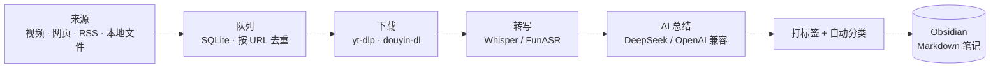

<div align="center">

# 📥 Auto Obsidian MD

**本地优先的学习资料入库工具 —— 把视频 / 网页 / 音频，自动变成结构化的 Obsidian 笔记。**

抖音 · B站 · YouTube · TikTok · 网页 · RSS · 本地 PDF/音视频
&nbsp;⟶&nbsp; 下载 ⟶ 转写 ⟶ AI 总结 ⟶ 打标签分类 ⟶ **Obsidian Markdown**

<br/>


[**⬇️ 下载 Windows 安装包**](https://github.com/Jaychouhyl/Auto-Obsidian-md/releases/latest) &nbsp;·&nbsp; [📖 使用说明](使用说明.md) &nbsp;·&nbsp; [📋 命令速查](#-命令速查)

</div>

---

## ✨ 功能特性

| | |
| :-- | :-- |
| 🎬 **多来源采集** | 抖音 / B站 / YouTube / TikTok 单链接，网页剪藏，RSS / Atom，播放列表 / 合集 / 收藏，本地文件与目录 |
| 🗣️ **自动转写** | 音视频经 Whisper / FunASR 转文字，PDF 抽取文本，字幕自动清洗 |
| 🤖 **AI 总结分类** | OpenAI 兼容大模型（DeepSeek 等）生成摘要 + 主题标签，并自动归入真实 Obsidian 文件夹 |
| 🗂️ **写入 Obsidian** | 直接写本地 vault，或接 Obsidian Local REST API |
| 👤 **账号中心** | 软件内用系统 Edge 登录、切换抖音 / B站 / YouTube / TikTok 多账号；密码只在平台网页输入，不入库 |
| 🧰 **依赖中心** | 自动检测外部工具，一键托管安装 `yt-dlp` / `ffmpeg` 并写回配置 |
| 🖥️ **桌面控制台** | Tauri 本机应用，普通用户免装 Python / Node / Rust；命令行同款能力一应俱全 |
| 🩺 **健康检查** | 一键体检配置、工具、API Key 是否就绪，缺项即时提示 |

## 🔄 处理流程



## 🚀 快速开始

### 🖥️ 普通用户（推荐，免环境）

1. 到 [**Releases**](https://github.com/Jaychouhyl/Auto-Obsidian-md/releases/latest) 下载 `Obsidian Ingest Studio_x.y.z_x64-setup.exe` 并安装 —— **无需 Python / Node.js / Rust**。
2. 首次启动会在 `%LOCALAPPDATA%\Obsidian Ingest Studio` 下创建工作区（配置、队列、缓存、导入文件都在这）。
3. 打开 **「账号」** → 选平台 → 「添加账号」，用系统 Edge 登录（详见 [账号登录](#-账号登录)）。
4. 打开 **「依赖」** 检测并一键安装媒体工具（详见 [前置依赖](#-前置依赖与依赖中心)）。
5. 在 **「配置」** 填好 Obsidian vault 路径与 LLM API Key，点 **「健康检查」** 全绿即可开跑。

> ⚠️ 只做网页 / RSS / 本地文本 / PDF 入库**无需额外安装**；要下载并转写抖音 / B站 / YouTube 音视频才需要媒体工具。未配置转写工具时音视频仍会入库，但只得到一条标了 `待补来源` 的占位笔记。

### 🧑‍💻 开发者（源码运行）

```powershell
# 1) 体检 + 跑测试
$env:PYTHONPATH = "$PWD\src"
py -3 -m unittest discover -s tests -v
.\run.ps1 doctor --config .\config.toml

# 2) 入库一条试试
.\run.ps1 add "https://www.bilibili.com/video/BVxxxx" --title "学习视频" --config .\config.toml
.\run.ps1 run --once --limit 1 --config .\config.toml
```

桌面端开发与打包见下方折叠块 **🖥️ 桌面端开发 / 打包**。

## 🧩 支持的来源

| 来源 | 命令 / 入口 |
| :-- | :-- |
| 单条链接（抖音 / B站 / YouTube / TikTok / 网页 / 本地文件） | `add <url 或路径>` |
| 批量链接 | `import-links links.txt` |
| `inbox` 文件夹 | `scan-inbox` |
| 任意本地目录 | `scan-directory --dir <目录>` |
| RSS / Atom | `collect-rss --feeds feeds.txt` |
| 网页剪藏 | `clip-webpage <url>` |
| 播放列表 / 频道 / 合集 / 收藏 | `collect-list <url> --platform youtube\|bilibili` |
| 抖音收藏夹 | `collect-douyin --count <N>`（账号见 [账号登录](#-账号登录)） |

## 📋 命令速查

```powershell
# —— 采集入队 ——
.\run.ps1 add "<url 或路径>" --title "标题" --config .\config.toml
.\run.ps1 import-links .\links.txt --config .\config.toml
.\run.ps1 scan-inbox --config .\config.toml
.\run.ps1 scan-directory --dir <资料目录> --json --config .\config.toml
.\run.ps1 collect-rss --feeds .\feeds.txt --limit 20 --json --config .\config.toml
.\run.ps1 clip-webpage "https://example.com/article" --json --config .\config.toml
.\run.ps1 collect-list "https://www.youtube.com/playlist?list=xxxx" --platform youtube --limit 20 --json --config .\config.toml
.\run.ps1 collect-douyin --count 20 --json --config .\config.toml

# —— 处理队列 ——
.\run.ps1 run --once --limit 10 --config .\config.toml

# —— 队列维护 ——
.\run.ps1 queue --status failed --json --config .\config.toml
.\run.ps1 retry-failed --limit 20 --json --config .\config.toml
.\run.ps1 skip 123 --reason "不再需要" --json --config .\config.toml

# —— 体检 / 依赖 ——
.\run.ps1 doctor --json --config .\config.toml
.\run.ps1 dependencies report --json --config .\config.toml
.\run.ps1 dependencies install --json --config .\config.toml

# —— 备份 / 恢复 ——
.\run.ps1 backup --json --config .\config.toml
.\run.ps1 restore .\backups\obsidian-ingest-backup-xxxx.zip --yes --json --config .\config.toml
```

## 👤 账号登录

账号登录使用电脑上已有的 **Microsoft Edge**，每个账号一份独立浏览器资料目录；密码和验证码只在平台官网输入，**不会写入项目配置**。

在桌面端点击 **「账号」** → 选平台 → 「添加账号」，登录完成后软件会显示识别到的昵称与平台 ID，确认后才保存或切换。账号元数据与登录态位于：

```text
%LOCALAPPDATA%\Obsidian Ingest Studio\accounts
```

## 🧰 前置依赖与依赖中心

安装包不要求 Docker / Python / Node.js / Rust / VS Code。桌面端 **「依赖」** 页会自动检测本机工具状态，并可一键下载并配置 `yt-dlp`、`ffmpeg` 到应用工作区：

```text
%LOCALAPPDATA%\Obsidian Ingest Studio\tools
```

仍需按提示手动处理的项目：

| 用途 | 需要的工具 |
| :-- | :-- |
| 抖音下载 | `douyin-dl` |
| 语音转文字 | `whisper` 或 `FunASR` |
| 摘要与自动分类 | 自己的 DeepSeek（或其它 OpenAI 兼容）API Key |
| 平台账号 | 在「账号」页用系统 Edge 登录 |

装好后，在桌面端 **「依赖」** 或 **「配置 → 健康检查」**（命令行 `dependencies report` / `doctor`）确认状态全部就绪。

---

<details>
<summary>🖥️ <b>桌面端开发 / 打包</b></summary>

<br/>

开发运行：

```powershell
cd <项目目录>
py -3 -m pip install pyinstaller
.\packaging\build-sidecar.ps1

cd .\desktop
$env:PATH = "$env:USERPROFILE\.cargo\bin;$env:PATH"
npm run tauri dev
```

打包 Windows 安装包：

```powershell
cd <项目目录>
.\packaging\build-sidecar.ps1

cd .\desktop
$env:PATH = "$env:USERPROFILE\.cargo\bin;$env:PATH"
npm run tauri build
```

构建产物在 `desktop/src-tauri/target/release/bundle/nsis/`。若 PowerShell 找不到 `cargo`，先临时加入 PATH：`$env:Path="$env:USERPROFILE\.cargo\bin;$env:Path"`。

</details>

<details>
<summary>🐳 <b>Docker 运行</b></summary>

<br/>

相关文件：`Dockerfile`、`docker-compose.yml`、`config.docker.toml`、`.env.example`。

```powershell
# 复制环境变量模板
Copy-Item .env.example .env

# 常驻容器（Docker Desktop 的 Containers 页可见）
& 'C:\Program Files\Docker\Docker\resources\bin\docker.exe' compose up -d --build console

# 一次性检查 / 批处理（结束即删除临时容器）
& 'C:\Program Files\Docker\Docker\resources\bin\docker.exe' compose run --rm ingest doctor --config /app/config.docker.toml
```

默认镜像不装 Whisper（避免首次构建过大）。需容器内转写时，把 `.env` 的 `INSTALL_WHISPER=false` 改为 `true`，再重建：

```powershell
& 'C:\Program Files\Docker\Docker\resources\bin\docker.exe' compose build --no-cache ingest
```

</details>

<details>
<summary>⚙️ <b>配置与安全</b></summary>

<br/>

- `config.toml` 是本机私有配置，**不提交**。
- `douyin-config.yml` 可能含 Cookie，**不提交**。
- `accounts/` 含本机账号登录资料，**不提交**。
- `links.txt`、`feeds.txt` 可能含个人资料来源，**不提交**。
- DeepSeek 或其他 LLM Key 通过**环境变量**提供。
- 私有 B站 / YouTube 收藏需要有效登录态，或先导出链接。

</details>

<details>
<summary>🗂️ <b>项目结构</b></summary>

<br/>

```text
src/obsidian_ingest      Python 入库引擎
desktop                  Tauri 桌面控制台
packaging                Windows sidecar 打包脚本
automation               Windows 批处理脚本
tests                    Python 回归测试
Dockerfile               CLI 容器镜像
docker-compose.yml       Docker Compose 入口
config.example.toml      本机配置模板
config.docker.toml       Docker 配置模板
INSTALL.md               安装说明
RELEASE.md               发布清单
使用说明.md              普通用户完整操作说明
```

</details>

<details>
<summary>✅ <b>本地验证（开发者）</b></summary>

<br/>

```powershell
cd <项目目录>
$env:PYTHONPATH = "$PWD\src"
py -3 -m unittest discover -s tests -v

cd .\desktop
npm run build

cd .\src-tauri
$env:Path="$env:USERPROFILE\.cargo\bin;$env:Path"
cargo check
```

</details>

---

<div align="center">
<sub>🐾 Made by 小黄狗 · 本地优先，数据留在你自己的机器上</sub>
</div>
